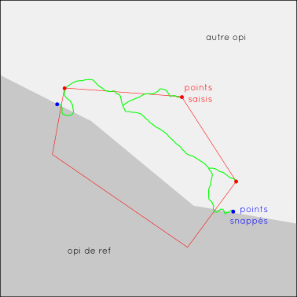
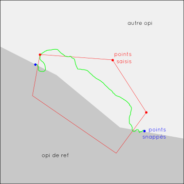
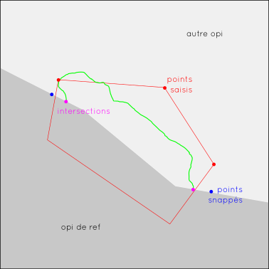
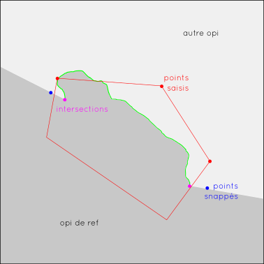
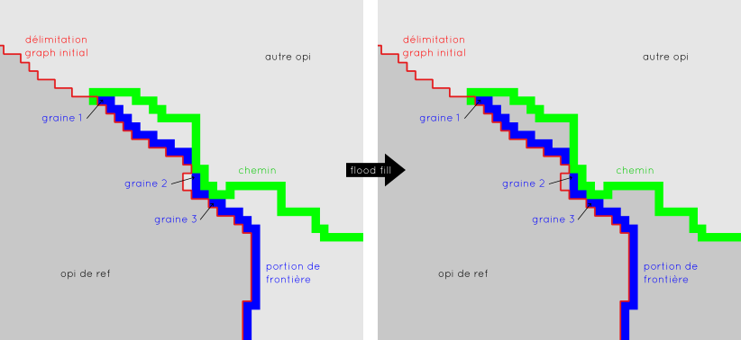

# Documentation développeur

Explication du fonctionnement de Dynamo

## 1. Import des opis

Import avec GDAL des deux fichiers opis dans une variable opi avec opi1 = canal 1, opi2 = canal 2.

Import du graph.tif = image monocanale avec les valeurs 0 pour les zones de no data, 1 pour l'opi de référence, 2 pour l'autre opi.

## 2. Récupération des points saisis

Un polygone de saisie est fourni dans un fichier geojson.
On récupère les points saisis qui ne sont pas dans l'opi de référence : intersection entre le polygone de saisie et le graph initial puis sélection de l'intersection qui recouvre l'autre opi.

Utilisation de la lib `Géopandas`.

## 3. Accroche des points de départ & d'arrivée sur le graph

On a une liste ordonnées des points de saisis. On y rajoute un point de départ et d'arrivée.
On prend comme point de départ le point le plus proche de valeur différente du premier point de la liste.
Et comme point d'arrivée le point le plus proche sur de valeur différente du dernier point de la liste.
Donc les points de départ et d'arrivée sont sur le graph initial et sur l'opi de ref.

## 4. Calcul du meilleur cheminement tronçon par tronçon par programmation dynamique

Pour chaque point de la liste, on calcule le meilleur chemin entre les points n-1 et n.

  1. Calcul de l'emprise de recherche du chemin = bbox sur les points n et n-1 avec une marge (paramètre).
  L'opi est masquée selon cette bbox avec des Nan.
  2. Calcul du coût initial de l'opi masquée (coût par simple différence et par corrélation selon paramètres tension, lambda1 et lambda2 = 1 - lambda1).
  3. Propagation des coûts cumulés par dijkstra (lib `Heap`). Un coût min très faible est ajouté au coût cumulé pour affiner la précision des coûts et limiter la multiplicité des solutions.
  4. Back-Propagation dans la matrice des coûts cumulés pour obtenir le chemin de moindre coût (en raster et en liste) à partir du point n jusqu'au point n-1.

On agrège chaque nouveau tronçon au précédent. Si un point saisi n'est pas optimal, l'agrégation des cheminements peut créer des aller retour ou des boucles. Il faut donc nettoyer ces défauts à cette étape. Ce nettoyage explique le fait que le chemin global ne passera pas forcement par les points saisis.

## 5. Nettoyage du chemin en amont et aval des intersection avec le graph initial

Pour opérer ce nettoyage on veut garder uniquement la plus grande portion de chemin global sans intersection avec le graph initial.

Plus précisement : Dans la liste ordonnée du chemin global on récupère les index des points qui intersectent le graph (du côté de l'opi de ref). On veut les deux intersections voisines les plus éloignées l'une de l'autre donc l'écart d'index le plus grand entre deux intersections voisines.

## 6. Construction du graph final (et de l'ortho)

Le graph final est rempli par diffusion de l'opi de référence jusqu'au nouveau chemin global de mosaïquage.
Utilisation de la fonction `flood_fill` de `skimage` qui propage une valeur donnée sur toute une plage de pixels égaux à partir d'un pixel donnée (graine) (https://scikit-image.org/docs/stable/auto_examples/segmentation/plot_floodfill.html).

Il faut trouver une graine de départ pour chaque zone entre le graph initial et le chemin global de mosaïquage :
  1. Calcul de la frontière du graphe initial du côté de l'autre opi.
  2. On souhaite la liste ordonnée des points sur cette frontière entre les points d'intersection du graph avec le chemin global de mosaïquage, pour cela on réutilise dijkstra : on passe les pixels sur cette frontière à 0 et le reste à 255, cette matrice sert de matrice de coût initial pour remonter la portion de graph initial avec dijkstra.
  3. On obtient la liste ordonnée des possibles graines. Reste à appliquer itérativement la fonction flood_fill pour chaque graine qui n'appartiennent pas encore à l'opi de référence.

  

L'ortho est construite en RVB à partir de ce graph avec l'opi de ref quand le graph indique 1, l'autre opi quand le graph indique 2.

## 7. Export des résultats

Exports en tif avec GDAL du chemin global, du masque global (toutes les zones de recherches confondues des meilleurs cheminements), du graph final, et de l'ortho RVB (lib rasterio).

***

